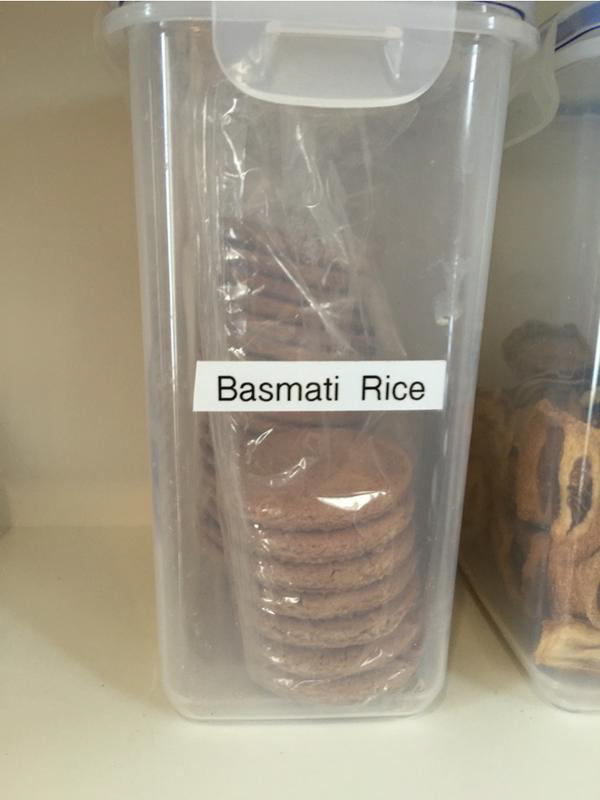
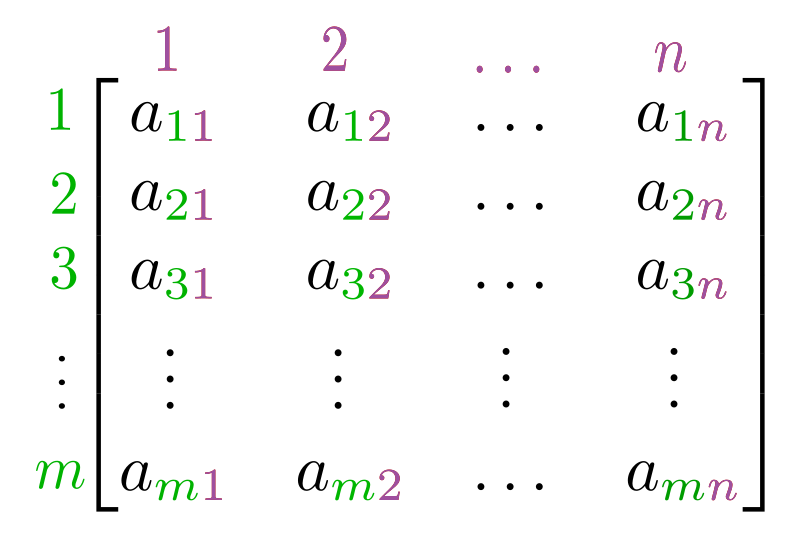
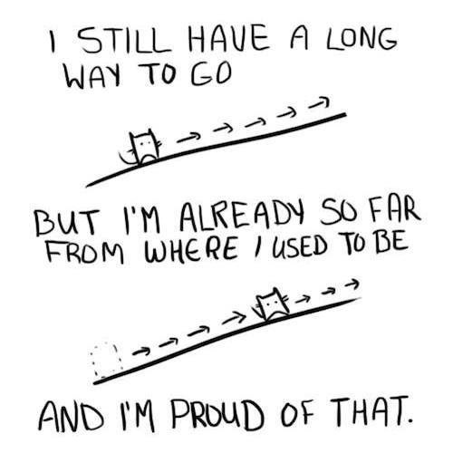
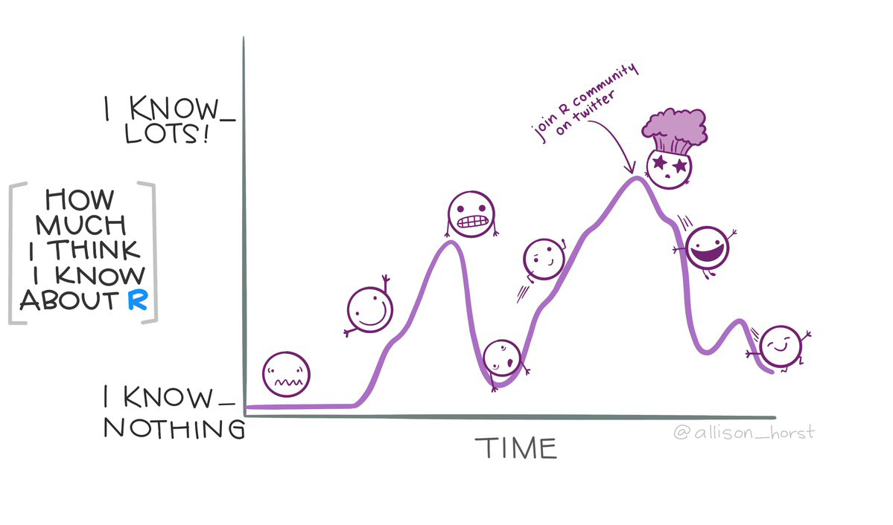

```{r setup, include=FALSE}
library(knitr)
knitr::opts_chunk$set(echo = TRUE)
```

# 1. Data Analysis

## Data Analysis in the Scientific Cycle

<center>

</center>

## Data-Intensive Research

- **Science and humanities are increasingly data-driven**
  - Early-career training has not prepared all researchers for this
  
<div class="highlight">
**Research Workflows**
</div>
- Enable systematic, replicable and reproducible work
  - Design principles
    - **Best practices** for data
  - Software development methods
    - **Automation** of repetitive calculations
 
<div class="references">
- Ten great papers for biologists starting out in computational biology <https://widdowquinn.github.io/ten_great_papers/>
</class>
 

## Pipelines and Workflows

<div class="highlight">
**Pipeline**
</div>
- What a computer does
  - A series of instructions
  - Data is *piped* through programs, and a result emerges

<div class="highlight">
**Workflow**
</div>
- What a researcher does
  - Exploring data, developing hypotheses, writing code, interpreting results
- Outputs include:
  - datasets, methods, teaching materials, software, papers, etc.


## Explore, Refine, Produce (ERP)

<center>

</center>

- [Reproduced from Stoudt *et al.* (2021)](https://doi.org/10.1371/journal.pcbi.1008770.g001)


# 2. Welcome to R


## Learning Objectives

- Fundamentals of `R` and `RStudio`
- Fundamentals of programming (in `R`)
- Data management with the `tidyverse`
- Publication-quality data visualisation with `ggplot2`
- Reporting with `RMarkdown`


## What is `R`?

- `R` is:
  - a programming language
  - the software that interprets/runs programs written in the `R` language

<div class="highlight">
**Why use `R`**?
</div>

- free (though commercial support can be bought)
- widely used
  - sciences, humanities, engineering, statistics, etc.
- has many excellent specialised packages for data analysis and visualisation
- international, friendly user community

<div class="references">
- RStudio community support: <https://community.rstudio.com/>
- Stack Overflow: <https://stackoverflow.com/>
</div>


## What is `RStudio`?

<div class="attention">
**Please start `RStudio`**
</div>

- `RStudio` is an *integrated development environment* (IDE)

<center>


</center>

<div class="highlight">
- Script/code editor; Project management
- Interaction with `R` (console/'scratchpad'); Graphics/visualisation/Help
</div>


## "Why not use `Excel`?"

<div class="highlight">
- `Excel` is good for some things
- `R` is excellent for analysis and reproducibility…
</div>

<center>

</center>

- ***Separates data from analysis***
- Not point-and-click: *every step is explicit and transparent*
- Easy to share, adapt, reuse, publish analyses with new/modified data (GitHub)
- `R` can be run on supercomputers, with *extremely* large datasets…

    
<div class="references">
* Mike Croucher's MLPM talk: <https://mikecroucher.github.io/MLPM_talk/>
</div>

## `RStudio` overview - INTERACTIVE DEMO

<center>

</center>


## Variables

<div class="highlight">
**Variables** are like *named boxes*
</div>

* An item (*object*) of data goes in the box (which is called `Name`)
* When we refer to the box (*variable*) by its name, we really mean *what's in the box*

<center>

</center>

## Variables - Interactive Demo

```{r, }
x <- 1 / 40
x
x ^ 2
log(x)
name <- "Samia"
name
```


## Naming Variables

<div class="highlight">
**Variable names are documentation**
</div>

```{r}
current_temperature = 28.6
subjectID = "GCF_00001236452.1"
GPS_Location = "54N, 36E"
```

- descriptive, but not *too* long
- letters, numbers, underscores, and periods (`[a-zA-z0-9_.]`)
- cannot contain whitespace or start with a number (`x2` is allowed, `2x` is not)
- case sensitive (`Weight` is not the same as `weight`)
- **do not reuse names of built-in functions**
- Consistent style:
  - `lower_snake`, `UPPER_SNAKE`, `lowerCamelCase`, `UpperCamelCase`


## Naming Variables

<center>

</center>


## Functions

<div class="highlight">
**Functions (`log()`, `sin()` etc.) ≈ "canned script"**
</div>

- automate complicated tasks
- make code more readable and reusable

<div class="attention">
- Functions usually take *arguments* (*input*)
- Functions often *return* values (*output*)
</div>

- Some functions are built-in (in *base* packages, e.g. `sqrt()`, `lm()`, `plot()`)
- Groups of related functions can be *imported* as *libraries*


## Getting Help in `R`

<center>
<div class="attention">
**INTERACTIVE DEMO**
</div>
</center>

```{r, eval=FALSE}
args(fname)            # arguments for fname
?fname                 # help page for fname
help(fname)            # help page for fname
??fname                # any mention of fname
help.search("text")    # any mention of "text"
vignette(fname)        # worked examples for fname
vignette()             # show all available vignettes
```

## Challenge 01 (1min)

<div class="highlight">
What will be the value of each variable after each statement in the following program?
</div>

```{r, echo=TRUE}
mass <- 47.5
age <- 122
mass <- mass * 2.3
age <- age - 20
```

* `mass = 47.5, age = 102`
* `mass = 109.25, age = 102`
* `mass = 47.5, age = 122`
* `mass = 109.25, age = 122`

<center>
<div class="attention">
**USE CHALLENGE LINK ON ETHERPAD**
</div>
</center>


# 3. Project Management in `R`


## How Projects Tend To Grow

<center>

</center>

## Good Practice

<center>
<div class="highlight">
**THERE IS NO ONE TRUE WAY (only principles)**
</div>
</center>

- Use a **single working directory per project/analysis**
  - easier to move, share, and find files
  - use *relative paths* to locate files
- **Treat raw data as read-only**
  - keep in a separate subfolder (`data`?)
- **Clean data ready for work *programmatically* **
  - keep cleaned/modified data in separate folder (`clean_data`?)
- **Consider output generated by analysis to be disposable**
  - can be regenerated by running analysis/code


<div class="references">
* Good Enough Practices in Scientific Computing (2017) Wilson *et al.* <http://journals.plos.org/ploscompbiol/article?id=10.1371/journal.pcbi.1005510>
</class>


## Example Directory Structure

<center>

</center>


## Project Management in `RStudio`

* `RStudio` tries to help you manage your projects
    * `R Project` concept - files and subdirectory structure
    * integration with version control
    * switching between multiple projects within `RStudio`
    * stores project history
    
<div class="highlight">
**Let's create a project in `RStudio`**
</div>

<center>
<div class="attention">
**INTERACTIVE DEMO**
</div>
</center>

<div class="references">
`RStudio` projects: <https://support.rstudio.com/hc/en-us/articles/200526207-Using-Projects>
</div>


## Working in `RStudio`

<div class="highlight">
We can write code in several ways in `RStudio`
</div>

- At the console (you've done this)
- In a **script**
- As an **interactive notebook**
- As a **markdown file**
- As a **Shiny app**

We're going to create a new dataset and `R` script.

* Putting code in a script makes it easier to modify, share and run

<center>
<div class="attention">
**INTERACTIVE DEMO**
</div>
</center>

# 4. A First Analysis in `RStudio`


## Our Task

- Patients have been given a new treatment for arthritis
- We have measurements of inflammation over a period of days for each patient
- We want to produce a preliminary analysis and graphs for this data

<div class="highlight">
Download the file from the following link to your `data/` directory, and extract it
</div>

- [https://github.com/swcarpentry/r-novice-inflammation/raw/main/data/r-novice-inflammation-data.zip](https://github.com/swcarpentry/r-novice-inflammation/raw/main/data/r-novice-inflammation-data.zip)

(**the link is also available on the course [Etherpad page](https://pad.carpentries.org/2021-05-04-strathclyde-online)**)

<div class="references">
EtherPad: <https://pad.carpentries.org/2021-05-04-strathclyde-online>
</div>


## Loading Data - Interactive Demo

- You created data manually earlier, but this is rare
- Data are most commonly read in from plain text files

<div class="highlight">
Data files can be inspected in `RStudio`
</div>

```{r, eval=FALSE}
read.csv(file = "data/inflammation-01.csv", header = FALSE)
```


## Challenge 02 (2min)

Someone gives you a data file that has:

- a comma (`,`) as the decimal point character
- semi-colon (`;`) as the field separator

How would you open it, using `read.csv()`

<center>
<div class="attention">
**Use the help function and documentation**
</div>
</center>

<center>
<div class="attention">
**USE CHALLENGE LINK ON ETHERPAD**
</div>
</center>


## Indexing Data

<center>

</center>


## Indexing Data

<center>
<div class="attention">
**INTERACTIVE DEMO**
</div>
</center>

- We use *indexing* to refer to elements of a matrix
  - square brackets: `[]`
  - row, then column: `[row, column]`

```{r, eval=FALSE}
data[1, 1]     # First value in dataset
data[30, 20]   # Middle value of dataset
```

* To get a range of values, use the `:` separator (meaning 'to')

```{r, eval=FALSE}
data[1:4, 1:4]   # rows 1 to 4; columns 1 to 4
```

* To select a complete row or column, leave it blank

```{r, eval=FALSE}
data[5, ]     # row 5
data[, 16]    # column 16
```


## Summary Functions

<center>
<div class="attention">
**INTERACTIVE DEMO**
</div>
</center>

- `R` provides useful functions to summarise data
- We can use *indexing* to get summary information on individual patients and days

```{r, eval=FALSE}
max(data)           # largest value in dataset
max(data[2, ])      # largest value for row (patient) 2
min(data[, 7])      # smallest value on column (day) 7
mean(data[, 7])     # mean value on day 7
sd(data[, 7])       # standard deviation of values on day 7
```


## Repetitive Calculations

<center>
<div class="attention">
**INTERACTIVE DEMO**
</div>
</center>

- Calculating for every patient (or day) this way is tedious

<div class="highlight">
**Computers exist to do tedious things for us**
</div>

- So `apply` a *function* (`mean`) to each row in the `data`:

- `R` has several ways to automate this process

```{r, eval=FALSE}
apply(X = data, MARGIN = 1, FUN = mean)
```

<div class="attention">
* `MARGIN = 1`: rows
* `MARGIN = 2`: columns
</div>

```{r, eval=FALSE}
rowMeans(data)
colMeans(data)
```


## Base Graphics

> "The purpose of computing is insight, not numbers.” - Richard Hamming

<div class="highlight">
- `R` has many available graphics packages
  - **graphically beautiful**
  - **specific problem domains**
- 'built-in' graphics are known as **base graphics**
</div>

- Base graphics are powerful tools for visualisation and understanding


## Plotting

<center>
<div class="attention">
**INTERACTIVE DEMO**
</div>
</center>

```{r, eval=FALSE}
plot(avg_inflammation_patient)

max_day_inflammation <- apply(dat, 2, max)
plot(max_day_inflammation)

plot(apply(dat,2,min))       # 3 functions in one!
```

<center>


</center>


## Challenge 03 (5min)

Can you add plots to your script showing:

- scatterplot of standard deviation of inflammation across all patients, by day
- a histogram of average inflammation across all patients, by day


# 5. Data Types and <br />Structures in `R`


## Learning Objectives

- Basic data types in `R`
- Common data structures in `R`
- How to find out the type/structure of `R` data
- Understand how `R`'s data types and structures relate to your own data


## Data Types and Structures in `R`

- `R` is mostly used for data analysis
- `R` has special *types* and *structures* to help you work with data
- Much of the focus is on tabular data (*data frames*) 

<center>
<div class="attention">
**INTERACTIVE DEMO**
</div>
</center>

<div class="highlight">
**Understanding data types, their uses, and how they relate to your own data is key to successful analysis with `R`**

(it's not just about programming)
</div>


## What Data Types Do You Expect?

<center>
<div class="highlight">
**What data types would you expect to see?**

What examples of data types can you think of from your own experience?
</div>

<div class="attention">
**Please write them into the chat**
</div>
</center>


## Data Types in `R`

- Data *types* in `R` are *atomic*
  - All data *structures* are built from these
    
<div class="highlight">
1. **logical**: `TRUE`, `FALSE`
2. **numeric**:
    * **integer**: `3`, `2L`, `123456`
    * **double** (*decimal*): `3.0`, `-23.45`, `pi`
3. **complex**: `3+0i`, `1+4i`
4. **character** (*text*): `"a"`, `'SWC'`, `"This is not a string"`
5. **raw**: binary data (**we won't cover this**)
</div>

<center>
<div class="attention">
**INTERACTIVE DEMO**
</div>
</center>


## Challenge 04 (2min)

Create examples of data with the following characteristics:

<div class="highlight">
- name: `answer`, type: `logical`
- name: `height`, type: `numeric`
- name: `dog_name`, type: `character`
</div>

For each variable, test that it has the data type you intended


## Four Common `R` Data Structures

- `vector`
- `factor`
- `list`
- `data.frame`

<center>
<div class="attention">
**INTERACTIVE DEMO**
</div>
</center>


## Challenge 05 (5min)

Vectors are *atomic*: they can contain only a single data *type*

What data type are the following vectors (`xx`, `yy`, `zz`)?

```R
xx <- c(1.7, "a")
yy <- c(TRUE, 2)
zz <- c("a", TRUE)
```

<div class="highlight">
Options: `logical`, `integer`, `numeric`, `character`
</div>

<center>
<div class="attention">
**USE CHALLENGE LINK ON ETHERPAD**
</div>
</center>


## Coercion

- *Coercion* means changing data from one *type* to another
- `R` will perform *implicit coercion* on vectors to make them atomic

<div class="highlight">
`logical` $\rightarrow$ `integer` $\rightarrow$ `double` $\rightarrow$ `complex` $\rightarrow$ `character`
</div>

<center>
<div class="attention">
**If there are formatting problems with your data, you might not have the type you expect when you import into `R`**
</div>
</center>

- Manual coercion with `as.<type_name>()`

<center>
<div class="attention">
**INTERACTIVE DEMO**
</div>
</center>


## Factors

Data comes as one of two types:

- *quantitative*: e.g. integers or real numbers <br />(`weight <- 17.2`; `rooms <- 7`)
- *categorical*:  e.g. ordered or unordered classes <br />(`grade <- "8"`, `coat <- "brindled"`)

<div class="highlight">
**This kind of distinction critical in many applications (e.g. statistical modelling)**
</div>

- **Factors** are special vectors that represent *categorical* data
  - Stored as vectors of *labelled integers*
  - **Cannot be treated as strings/text**

<center>
<div class="attention">
**INTERACTIVE DEMO**
</div>
</center>


## Challenge 06 (5min)

Create a new `factor`, defining `control` and `case` experiments, and inspect the result:

```{r}
f <- factor(c("case", "control", "case", "control", "case"))
str(f)
```

<div class="attention">
**In some statistical analyses in `R` it is important that the `control` level is numbered `1`**
</div>

<div class="highlight">
- Using the help available to you in `RStudio`, can you create a factor with the same values, but where the `control` level is numbered `1`?
</div>


## Lists

- `list`s are like *vectors*, but can hold *any combination of datatype*
  - *elements* in a `list` are denoted by `[[]]` and can be named
    
<center>
<div class="attention">
**INTERACTIVE DEMO**
</div>
</center>

```{r}
# create a list
l <- list(1, 'a', TRUE, matrix(0, nrow = 2, ncol = 2), f)
l_named <- list(a = "SWC", b = 1:4)
```


## Logical Indexing

- We have used *indexing*, *slicing* and *names* to get data **by 'location'**

```{r, eval=FALSE}
> animal[c(2,4,6)]
[1] "o" "k" "y"
> l_named$b
[1] 1 2 3 4
```

- *Logical indexes* select data that meets certain criteria

<center>
<div class="attention">
**INTERACTIVE DEMO**
</div>
</center>

```{r, eval=FALSE}
x <- c(5.4, 6.2, 7.1, 4.8, 7.5)
mask <- c(TRUE, FALSE, TRUE, FALSE, TRUE)
x[mask]
x[x > 7]
```


# 6. Dataframes


## Let's look at a `data.frame`

- The `cats` data is a `data.frame`

<center>
<div class="attention">
**INTERACTIVE DEMO**
</div>
</center>

```{r, eval=FALSE}
> class(cats)
[1] "data.frame"
> cats
    coat weight likes_string
1 calico    2.1            1
2  black    5.0            0
3  tabby    3.2            1
```


## What is a `data.frame`?

<div class="highlight">
- The standard `R` data structure for storing tabular, *rectangular* data
</div>

- A named `list` of `vector`s having identical lengths.
  - Each column is a `vector`
  - Each `vector` can be a different data type
    
<div class="attention">
- This is very much **LIKE** a spreadsheet, but…
  - **Columns are constrained to a type**
  - **Columns are all the same length**
</div>


## Creating a `data.frame`

<center>
<div class="attention">
**INTERACTIVE DEMO**
</div>
</center>

```{r}
# Create a data frame
df <- data.frame(a=c(1,2,3), b=c('eeny', 'meeny', 'miney'),
                 c=c(TRUE, FALSE, TRUE))
summary(df)
```


## Saving a `data.frame` to file

<center>
<div class="attention">
**INTERACTIVE DEMO**
</div>
</center>

```{r, eval=FALSE}
write.table(df, "data/df_example.tab", sep="\t")
```

We need to provide

- the `data.frame`
- the path to the file being written
- a column separator


## Loading a `data.frame`

<center>
<div class="attention">
**INTERACTIVE DEMO**
</div>
</center>

<div class="highlight">
- Download data from [https://raw.githubusercontent.com/resbaz/r-novice-gapminder-files/master/data/gapminder-FiveYearData.csv](https://raw.githubusercontent.com/resbaz/r-novice-gapminder-files/master/data/gapminder-FiveYearData.csv)
- Put the file in the `data/` directory

**The link is available on the course [Etherpad](https://pad.carpentries.org/2021-05-04-strathclyde-online)**
</div>

```{r, eval=FALSE}
gapminder <- read.table("data/gapminder-FiveYearData.csv", sep=",", header=TRUE)
```

* `R` can also read data direct from the internet

```{r}
url <- paste("https://raw.githubusercontent.com/resbaz/",
             "r-novice-gapminder-files/master/data/",
             "gapminder-FiveYearData.csv", sep = '')
gapminder <- read.table(url, sep=",", header=TRUE)
```

<div class="references">
EtherPad: <https://pad.carpentries.org/2021-05-04-strathclyde-online>
</div>


## Investigating `gapminder`

<center>
<div class="attention">
**INTERACTIVE DEMO**
</div>
</center>

```{r, eval=FALSE}
str(gapminder)              # structure of the data.frame
typeof(gapminder$year)      # data type of a column
length(gapminder)           # length of the data.frame
nrow(gapminder)             # number of rows in data.frame
ncol(gapminder)             # number of columns in data.frame
dim(gapminder)              # number of rows and columns in data.frame
colnames(gapminder)         # column names from data.frame
head(gapminder)             # first few rows of dataframe
summary(gapminder)          # summary of data in data.frame columns
```


# 7. Packages


## Packages

In `R`:

- a *package* is a collection (or *library*) of reusable code
- many useful and specialist tools are distributed as packages
- over 10,000 packages are available at `CRAN`
- you can distribute your own code as a package

<center>
<div class="attention">
**INTERACTIVE DEMO**
</div>
</center>

```{r eval=FALSE}
installed.packages()               # see installed packages
install.packages("packagename")    # install a new package
update.packages()                  # update installed packages
library(packagename)               # import a package for use in your code
```

<div class="references">
CRAN - the Comprehensive `R` Archive Network: <https://cran.r-project.org/>
</div>


## Challenge 07 (5min)

Can you check if the following packages are installed on your system, and install them if necessary?

```{r, eval=FALSE}
dplyr
ggplot2
knitr
```


# 8. Creating Publication-<br />Quality Graphics


## Visualisation is Critical!

<center>

</center>


## The Grammar of Graphics

- `ggplot2` is part of the *Tidyverse*, a collection of packages for data science
  - `ggplot2` is the graphics package
    
<div class="highlight">
- **Implements the "Grammar of Graphics"**
  - Separates data from its representation
  - Helps iteratively update/refine plots
  - Helps build complex, effective visualisations from simple elements
</div>

<div class="attention">
- *data*
- *aesthetics*
- `geom`s
- *layers*
</div>

<div class="references">
- Tidyverse: <https://www.tidyverse.org/>
</div>


## A Basic Scatterplot

- You can use `ggplot2` like *base graphics*
  - `qplot()` ≈ `plot()`

<center>
<div class="attention">
**INTERACTIVE DEMO**
</div>
</center>

```{r, eval=FALSE}
library(ggplot2)
plot(gapminder$lifeExp, gapminder$gdpPercap, col=gapminder$continent)
qplot(lifeExp, gdpPercap, data=gapminder, colour=continent)
```

<center>


</center>


## What is a Plot? *aesthetics*

- Each observation in the *data* is a point
- A point's *aesthetics* determine how it is rendered
  - co-ordinates on the image; size; shape; colour
- *aesthetics* can be constant or mapped to variables
- **Many different plots can be generated from the same data by changing *aesthetics***

<center>

</center>

## What is a Plot? `geom`s

<div class="highlight">
`geom` (short for *geometry*) defines the "type" of representation
</div>

- If data are drawn as points: **scatterplot**
- If data are drawn as lines: **line plot**
- If data are drawn as bars: **bar chart** 

<center>

</center>

<div class="attention">
- **`ggplot2` provides several `geom` types**
</div>


## What is a Plot? `geom`s

<div class="highlight">
**The same *data* and *aesthetics* can be shown with different `geom`s**
</div>

<center>
<div class="attention">
**INTERACTIVE DEMO**
</div>
</center>

```{r, eval=FALSE}
# Generate plot of GDP per capita against life Expectancy
p <- ggplot(data=gapminder, aes(x=lifeExp, y=gdpPercap, color=continent))
p + geom_point()
p + geom_line()
```


## Challenge 08 (2min)

<div class="highlight">
Can you create another figure in your script showing how *life expectancy* changes as a function of *time*, as a scatterplot?
</div>


## What is a Plot? *layers*

- We've just used another "Grammar of Graphics" concept: *layers*
  - `ggplot2` plots are built as *layers*
    
<div class="highlight">
All *layers* have two components

1. *data* and *aesthetics*
2. a `geom`
</div>

- *Data* and *aesthetics* can be defined in a *base* `ggplot` object
  - values from the *base* are *inherited* by the other layers
  - the *base* can be overridden in other layers


## What is a Plot? *layers*

- *Data* and *aesthetics* can be defined in a *base* `ggplot` object
  - values from the *base* are *inherited* by the other layers
  - the *base* can be overridden in other layers

```{r, eval=FALSE}
p <- ggplot(data=gapminder, aes(x=lifeExp, y=gdpPercap, colour=continent))
p + geom_point()
```

<center>

</center>


## What is a Plot? *layers*

- *Data* and *aesthetics* can be defined in a *base* `ggplot` object
  - values from the *base* are *inherited* by the other layers
  - the *base* can be overridden in other layers

```{r, eval=FALSE}
p <- ggplot(data=gapminder, aes(x=lifeExp, y=gdpPercap, colour=continent))
p + geom_line(aes(group=country))
```

<center>

</center>

<center>
<div class="attention">
**INTERACTIVE DEMO**
</div>
</center>


## What is a Plot? *layers*

- We can use several layers of `geom`s to build a plot
  - `alpha` controls *opacity* for a layer

```{r, eval=FALSE}
p <- ggplot(data=gapminder, aes(x=lifeExp, y=gdpPercap, color=continent))
p + geom_line(aes(group=country)) + geom_point(alpha=0.4)
```

<center>

</center>

<center>
<div class="attention">
**INTERACTIVE DEMO**
</div>
</center>


## Challenge 09 (5min)

Can you create another figure in your script showing how *life expectancy* changes as a function of *time*, coloured by continent, with two layers:

<div class="highlight">
- a line plot, grouping points by country
- a scatterplot showing each data point, with 35% opacity
</div>


## Transformations and `scale`s

- Data transformations are handled with `scale` layers

<div class="highlight">
- axis scaling (log scales)
- colour scaling (changing palettes)
</div>

<center>

</center>

<center>
<div class="attention">
**INTERACTIVE DEMO**
</div>
</center>


## Statistics layers

- Some `geom` layers transform the dataset
  - Usually this is a data summary (e.g. smoothing or binning)
   
<center>

</center>

<center>
<div class="attention">
**INTERACTIVE DEMO**
</div>
</center>


## Multi-panel figures

- So far all our plots have all data in a single figure
- Comparisons can be clearer with multiple panels:
  - *facets*
  - "small multiples plots"

<div class="highlight">
Use the `facet_wrap()` layer to generate grids of plots
</div>
    
<center>
<div class="attention">
**INTERACTIVE DEMO**
</div>
</center>

```{r, eval=FALSE}
# Compare life expectancy over time by continent
p <- ggplot(data=gapminder, aes(x=year, y=lifeExp, colour=continent,
                                group=country))
p <- p + geom_line() + scale_y_log10()
p + facet_wrap(~continent)
```


## Challenge 10 (5min)

Can you create a scatterplot and contour densities of GDP per capita against population size, with colour filled by continent?

<div class="highlight">
**ADVANCED:** Transform the *x* axis to better visualise data spread, and use facets to panel density plots by year.
</div>


# 9. Data Cleaning/Tidy Data


## Why Tidy Data?

> "Tidy datasets are all alike, but every messy dataset is messy in its own way"

- Data Cleaning is not just a first step
  - repeated when new data turns up, new ideas arrive, etc.
- About 80% of the effort of data analysis is cleaning and preparing data

<div class="highlight">
Principles of **Tidy Data** provide a standard way to organise data values within a dataset
</div>

<div class="references">
- `R` for Data Science: <http://r4ds.had.co.nz/>
- Data Wrangling cheat sheet: <https://www.rstudio.com/wp-content/uploads/2015/02/data-wrangling-cheatsheet.pdf>
- Introduction to `dplyr`: <https://cran.rstudio.com/web/packages/dplyr/vignettes/introduction.html>
- Data Wrangling with `R` and `RStudio`: <https://www.rstudio.com/resources/webinars/data-wrangling-with-r-and-rstudio/>
</div>


## A Messy Dataset (1)

```{r}
df1 <- data.frame(treatment=c("treatmenta", "treatmentb"),
                  John.Smith=c(NA, 2),
                  Jane.Doe=c(16, 11),
                  Mary.Johnson=c(3, 1))
colnames(df1) = c("", "John Smith", "Jane Doe", "Mary Johnson")
```

```{r, echo=FALSE}
kable(df1)
```


## A Messy Dataset (2)

```{r}
df2 <- data.frame(name=c("John Smith", "Jane Doe", "Mary Johnson"),
                 treatmenta=c(NA, 16, 3),
                 treatmentb=c(2, 11, 1))
colnames(df2) = c("", "treatmenta", "treatmentb")
```

```{r, echo=FALSE}
kable(df2)
```


## Data Semantics

- A dataset is a collection of **VALUES**

```{r, echo=FALSE}
kable(df1)
```

<div class="highlight">
- Each **value** belongs to a **variable** and an **observation**
</div>

- **VARIABLES**: can *change* or *vary*
  - values that are *measured** or *decided* by a researcher: height, temperature, duration, treatment, etc.
- **OBSERVATIONS**: values measured across all variables for the same individual/unit/group: person, reactor, religion, company, etc.


## Challenge 11 (2min)

<div class="highlight">
In the table below, what is the correct assignment for rows and columns?
</div>

```{r, echo=FALSE}
kable(df1)
```

<p />
- Rows=OBERVATIONS, Columns=OBSERVATIONS
- Rows=OBERVATIONS, Columns=NEITHER
- Rows=NEITHER, Columns=OBSERVATIONS
- Rows=NEITHER, Columns=NEITHER

<center>
<div class="attention">
**USE CHALLENGE LINK ON ETHERPAD**
</div>
</center>


## A Tidy Dataset (1)

<div class="highlight">
- The dataset contains 18 values:
  - three variables
  - six observations
</div>

- **VARIABLES**
  - person (John, Mary, Jane)
  - treatment (a and b)
  - result (`NA`, 16, 3, 2, 11, 1)

```{r, echo=FALSE}
df3<- data.frame(name=c("John Smith", "Jane Doe", "Mary Johnson",
                         "John Smith", "Jane Doe", "Mary Johnson"),
                  treatment=c("a", "a", "a", "b", "b", "b"),
                  result=c(NA, 16, 3, 2, 11, 1))
```


<div class="attention">
Each **OBSERVATION** includes all three variables
</div>


## A Tidy Dataset (2)

```{r, echo=FALSE}
kable(df3)
```


## Tidy Data

- Tidy data is a standard way of structuring a dataset
  - not the only way
  - makes it easy to extract needed varaibles
  - well suited to `R` (supports vectorisation)

<div class="highlight">
1. Each **VARIABLE** forms a column
2. Each **OBSERVATION** forms a row
</div>

<div class="attention">
- The *real* data you receive may often need to be cleaned to be in Tidy form
- Messy forms are sometimes useful
</div>

<center>
<div class="attention">
**INTERACTIVE DEMO**
</div>
</center>


# 10. Working With Tidy Data


## Learning Objectives

- How to manipulate `data.frame`s with the six *verbs* of `dplyr`
  - a 'grammar of data manipulation'

<div class="highlight">
- `select()`
- `filter()`
- `group_by()`
- `summarize()`
- `mutate()`
- `%>%` (pipe)
</div>

<div class="references">
- `R` for Data Science: <http://r4ds.had.co.nz/>
- Data Wrangling cheat sheet: <https://www.rstudio.com/wp-content/uploads/2015/02/data-wrangling-cheatsheet.pdf>
- Introduction to `dplyr`: <https://cran.rstudio.com/web/packages/dplyr/vignettes/introduction.html>
- Data Wrangling with `R` and `RStudio`: <https://www.rstudio.com/resources/webinars/data-wrangling-with-r-and-rstudio/>
</div>


## What and Why is `dplyr`?

- `dplyr` is another package in the *Tidyverse*
- Facilitates analysis by *groups* in Tidy Data
  - Helps avoid repetition
    
```{r, eval=FALSE}
> mean(gapminder[gapminder$continent == "Africa", "gdpPercap"])
[1] 2193.755
> mean(gapminder[gapminder$continent == "Americas", "gdpPercap"])
[1] 7136.11
> mean(gapminder[gapminder$continent == "Asia", "gdpPercap"])
[1] 7902.15
```

<div class="highlight">
Avoiding repetition (though automation) makes code

* **robust**
* **reproducible**
</div>


## Split-Apply-Combine

<center>

</center>


## `select()` - Interactive Demo

```{r, eval=FALSE}
library(dplyr)
```

<center>

</center>

```{r, eval=FALSE}
select(gapminder, year, country, gdpPercap)
gapminder %>% select(year, country, gdpPercap)
```


## `filter()`

* `filter()` selects rows on the basis of some condition

<center>
<div class="attention">
**INTERACTIVE DEMO**
</div>
</center>

```{r, eval=FALSE}
filter(gapminder, continent=="Europe")

# Select gdpPercap by country and year, only for Europe
eurodata <- gapminder %>%
              filter(continent == "Europe") %>%
              select(year, country, gdpPercap)
```


## Challenge 12 (5min)

Can you write a single line (which may span multiple lines in your script by including pipes) to produce a dataframe from `gapminder` containing:

<div class="highlight">
- life expectancy, country, and year data
- only for African nations
</div>

How many rows does the dataframe have


## `group_by()`

<center>
<div class="attention">
**INTERACTIVE DEMO**
</div>
</center>

<center>

</center>

```{r, eval=FALSE}
group_by(gapminder, continent)
gapminder %>% group_by(continent)
```


## `summarize()`

<center>
<div class="attention">
**INTERACTIVE DEMO**
</div>
</center>

<center>

</center>

```{r, eval=FALSE}
# Produce table of mean GDP by continent
gapminder %>%
    group_by(continent) %>%
    summarize(meangdpPercap=mean(gdpPercap))

```


## Challenge 13 (5min)

<div class="highlight">
- Can you calculate the average life expectancy per *country* in the `gapminder` data?
- Which nation has longest life expectancy, and which the shortest?
</div>


## `count()` and `n()`

- Two useful functions related to `summarize()`
  - `count()`/`tally()`: a function that reports a table of counts by group
  - `n()`: a function used *within* `summarize()`, `filter()` or `mutate()` to represent count by group
    
<center>
<div class="attention">
**INTERACTIVE DEMO**
</div>
</center>

```{r, eval=FALSE}
gapminder %>%
  filter(year == 2002) %>%
  count(continent, sort = TRUE)

gapminder %>%
  group_by(continent) %>%
  summarize(se_lifeExp = sd(lifeExp)/sqrt(n()))
```


## `mutate()`

- `mutate()` is a function allowing creation of new variables

<center>
<div class="attention">
**INTERACTIVE DEMO**
</div>
</center>

```{r, eval=FALSE}
# Calculate GDP in $billion
gdp_bill <- gapminder %>%
  mutate(gdp_billion = gdpPercap * pop / 10^9)

# Calculate total/sd of GDP by continent and year
gdp_bycontinents_byyear <- gapminder %>%
    mutate(gdp_billion=gdpPercap*pop/10^9) %>%
    group_by(continent,year) %>%
    summarize(mean_gdpPercap=mean(gdpPercap),
              sd_gdpPercap=sd(gdpPercap),
              mean_gdp_billion=mean(gdp_billion),
              sd_gdp_billion=sd(gdp_billion))
```


# 11. Programming in `R`


## Learning Objectives

- How to make data-dependent choices in `R`
- Use `if()` and `else()`
- Repeat operations in `R`
- Use `for()` loops
- *vectorisation* to avoid repeating operations
- Writing *functions* to avoid repetition and make code reusable


## `if()` … `else`

- We often want to perform operations (or not) *conditional* on whether something is `TRUE`
  - The `if()` and `else` construct is useful for this
    
```R
# if
if (condition is true) {
  PERFORM ACTION
}

# if ... else
if (condition is true) {
  PERFORM ACTION
} else {  # i.e. if the condition is false,
  PERFORM ALTERNATIVE ACTION
}
```

<center>
<div class="attention">
**INTERACTIVE DEMO**
</div>
</center>


## Challenge 14 (2min)

<div class="highlight">
Can you use an `if()` statement to report whether there are any records from 2002 in the `gapminder` dataset?

Can you do the same for 2012?
</div>

<div class="attention">
**HINT:** Look at the help for the `any()` function
</div>


## `for()` loops

- `for()` loops are a very common construct in programming
  - `for` each `<item>` in a group, `<do something (with the item)>`
- Not as useful in `R` as in some other languages

```{r, eval=FALSE}
for(iterator in set of values){
  do a thing
}
```

<center>
<div class="attention">
**INTERACTIVE DEMO**
</div>
</center>


## `while()` loops

- `while()` loops are useful when you need to *do something* **while** some condition is true

```{r, eval=FALSE}
while(this condition is true){
  do a thing
}
```

<center>
<div class="attention">
**INTERACTIVE DEMO**
</div>
</center>


## Challenge 15 (2min)

<div class="highlight">
Can you use a `for()` loop and an `if()` statement to print whether each letter in the alphabet is a vowel?
</div>

<div class="attention">
**HINT:** Use `R`'s help for `letters` and `%in%`
</div>


## Vectorisation

- `for()` and `while()` loops can be useful, but are not *efficient*
- Most functions in `R` are *vectorised*
  - When applied to a *vector*, apply to all elements in that *vector*
  - **No need to loop**
    
<div class="highlight">
You've already seen and used much of this behaviour
</div>
    
<center>
<div class="attention">
**INTERACTIVE DEMO**
</div>
</center>

```{r, eval=FALSE}
x < 1:4
x * 2
y <- 6:9
x + y
```


## Challenge 16 (2min)

We want to sum the following series of fractions

$\frac{1}{1^2} + \frac{1}{2^2} + \frac{1}{3^2} + \ldots + \frac{1}{n^2}$

for large values of $n$

<div class="highlight">
Can you do this using vectorisation for $n = 10,000$?
</div>


# 12. Functions


## Why Functions?

- Functions let us **run a complex series of commands in one go**
  - under a memorable/descriptive *name*
  - invoked with that *name*
  - with a defined set of *inputs* and *outputs*
  - to perform a logically coherent task
    
<div class="highlight">    
Functions are the building blocks of programming
</div>

- Small functions with one obvious, clearly-defined task are best


## Defining a Function

- You will often need to write your own functions
- They take a standard form

```{r, eval=FALSE}
<function_name> <- function(<arg1>, <arg2>) {
  <do something>
  return(<result>)
}
```

<center>
<div class="attention">
**INTERACTIVE DEMO**
</div>
</center>

```{r, eval=FALSE}
my_sum <- function(a, b) {
  the_sum <- a + b
  return(the_sum)
}
```


## Documentation

- So far, you've been able to use `R`'s built-in help to see function documentation
  - This isn't available for *your* functions unless *you* write it

<center>    
<div class="highlight">
**Your future self will thank you!**

(and so will your colleagues)

*Write programs for people, not for computers*
</div>
</center>

- State what the code does (and why)
- Define inputs and outputs
- Give an example

<center>
<div class="attention">
**INTERACTIVE DEMO**
</div>
</center>


## Function Arguments

- We can define functions that take multiple arguments
- We can also define default values for arguments

<center>
<div class="attention">
**INTERACTIVE DEMO**
</div>
</center>

```{r, eval=FALSE}
# Calculate total GDP in gapminder data
calcGDP <- function(data, year_in=NULL, country_in=NULL) {
  gdp <- data %>% mutate(gdp=(pop * gdpPercap))
  if (!is.null(year_in)) {
    gdp <- gdp %>% filter(year %in% year_in)
  }
  if (!is.null(country_in)) {
    gdp <- gdp %>% filter(country %in% country_in)
  }
  return(gdp)
}
```


## Challenge 17 (10min)

<div class="highlight">
Can you write a function that takes an optional argument called `letter`, which:

* Plots the life expectancy per year for each country
* Only for countries whose name starts with a letter in `letter`
* Uses `facet_wrap()` to produce a grid of output graphs
</div>

* **ADVANCED:** Make the facet wrapping optional

<div class="attention">
**HINT:** The following code may be useful

```{r, eval=FALSE}
starts.with <- substr(gapminder$country, start = 1, stop = 1)
az.countries <- gapminder[starts.with %in% c("A", "Z"), ]
```
</div>


# 13. Dynamic Reports


## Literate Programming

- A *programming paradigm* introduced by Donald Knuth
- The program (or analysis) is explained in natural language
  - The *source code* is interspersed
- The whole document is *executable*

<div class="highlight">
**We can produce these documents in `RStudio`**
</div>

<div class="references">
- Literate Programming, by Donald Knuth: <http://www.literateprogramming.com/knuthweb.pdf>
</div>


## Create an `R Markdown` file

- `R Markdown` files embody Literate Programming in `R`
- `File` $\rightarrow$ `New File` $\rightarrow$ `R Markdown`
- Enter a title
- Save the file (gets the extension `.Rmd`)

<center>


</center>


## Components of an `R Markdown` file

- Header information is *fenced* by `---`

```{r, eval=FALSE}
---
title: "Literate Programming"
author: "Leighton Pritchard"
date: "04/12/2017"
output: html_document
---
```

- Natural language is written as plain text

```{r, eval=FALSE}
This is an R Markdown document. Markdown is a simple formatting syntax
```

- `R` code (which is executable) is *fenced* by *backticks* (```)

<center>
<div class="attention">
**Click on `Knit`**
</div>
</center>


## Creating a Report

* We're going to create an `R Markdown` report on the `gapminder` data

<center>
<div class="attention">
**INTERACTIVE DEMO**
</div>
</center>

<center>

</center>

<div class="references">
- `R Markdown` documentation: <http://rmarkdown.rstudio.com/>
- `R Markdown` cheat sheet: <http://www.rstudio.com/wp-content/uploads/2015/02/rmarkdown-cheatsheet.pdf>
- Getting started with `R Markdown`: <https://www.rstudio.com/resources/webinars/getting-started-with-r-markdown/>
- Reproducible reporting: <https://www.rstudio.com/resources/webinars/reproducible-reporting/>
</div>


# 14. Conclusion


## You have learned:

<div class="highlight">
- About `R`, `RStudio` and how to set up a project
- How to load data into `R` and produce summary statistics and plots with *base* tools
- All the data types in `R`, the most important data structures
- How to install and use packages
- How to use the Tidyverse to manipulate and plot data
- How to use program flow control and functions
- How to create dynamic reports in `R`
</div>

<center>
<div class="attention">
**WELL DONE!!**
</div>
</center>


## The End Is The Beginning

<center>


</center>


## Where Next?

<center>

</center>


